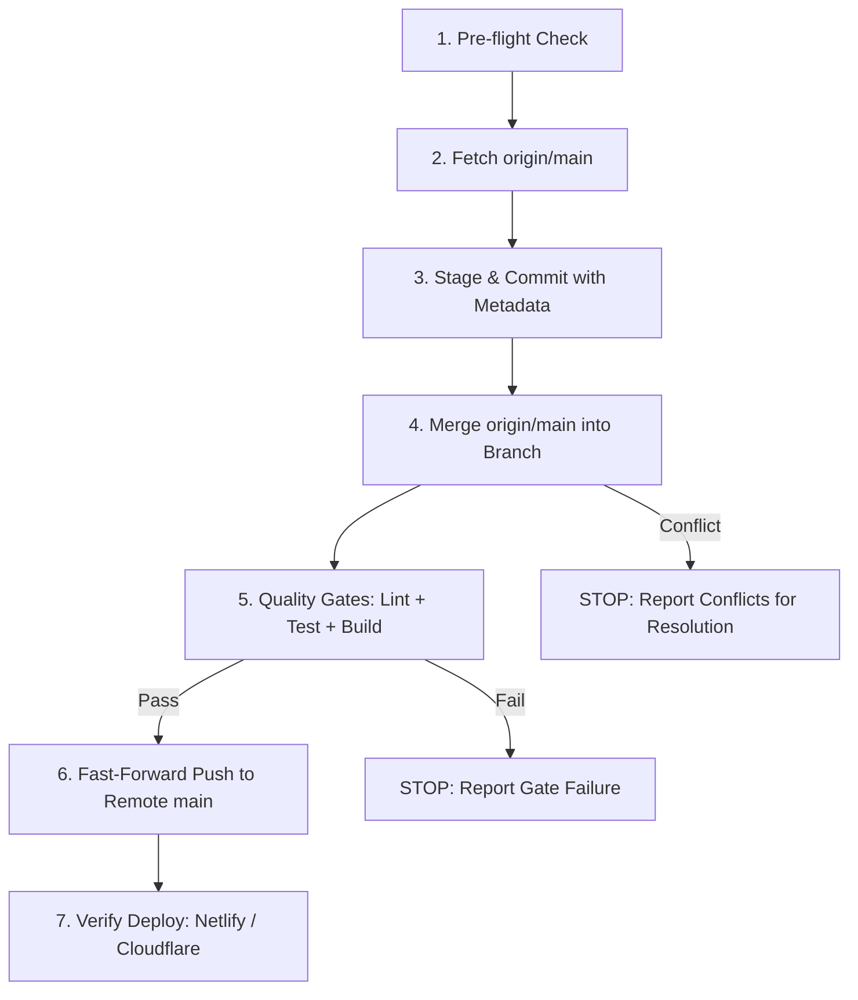

# Ship and Deploy Skill

This skill guides Antigravity through the complete, safe, and automated commit-pull-merge-gate-push-deploy sequence for web applications and PWAs (such as WORKZ).

## When to Use

Trigger this skill whenever the user asks to:
- Ship, commit, push, merge, pull, or deploy changes to production.
- Lithuanian triggers: `"ship"`, `"comitink"`, `"pushink"`, `"mergink"`, `"pulink"`, `"deployink i netlify"`, `"išsiųsk į produkciją"`, `"sukelk pakeitimus"`.
- English triggers: `"ship to production"`, `"deploy to netlify"`, `"commit and push"`, `"integrate and deploy"`.

---

## The 7-Step Deployment Protocol



### 1. Pre-Flight Check
Confirm git working branch and merge state:
```bash
BRANCH=$(git rev-parse --abbrev-ref HEAD)
git rev-parse -q --verify MERGE_HEAD && echo "MERGE-IN-PROGRESS" || echo "CLEAN-MERGE-STATE"
```
- If detached `HEAD` → checkout or create a named branch first.
- If `MERGE_HEAD` exists from an unfinished merge → stop and resolve or abort before proceeding.

### 2. Fetch Latest Remote State
```bash
git fetch origin main
```

### 3. Stage & Commit (With Audit Metadata)
Stage all modified and untracked files:
```bash
git add -A
```
If there are uncommitted changes, compose a conventional commit with the mandatory audit metadata block:
```bash
git commit -F - <<'EOF'
<type>(<scope>): <concise summary of changes>

- <detailed bullet 1>
- <detailed bullet 2>

[ai-author: <agent-model-name>]
Reason: <why this change was made and what goal/rule it serves>
EOF
```

### 4. Integrate `origin/main`
Integrate remote main into the current branch:
```bash
git merge --no-edit origin/main
```
- **If conflicts occur:** Stop immediately, report conflicted files (`git diff --name-only --diff-filter=U`), and resolve markers before continuing. Never force-commit unverified conflict markers.

### 5. Quality Gate (Deterministic Verification)
Run deterministic gates in sequence:
1. **Linter:** `npm run lint` (must pass with 0 errors/warnings).
2. **Unit Tests:** `npm test` (vitest / jest test suite).
3. **Production Bundle:** `npm run build` (vite / webpack production build + service worker).

If any gate fails, **STOP** and do not push to production.

### 6. Fast-Forward Push to Remote Main
Push the verified branch tip to `origin/main`:
```bash
git push origin HEAD:main
```
Sync the local `main` ref (best effort):
```bash
git fetch origin main:main || true
```

### 7. Trigger & Verify Deploy
A push to `main` automatically triggers production builds on:
- **Netlify:** Connected repository builds and deploys to the production domain.
- **Cloudflare Pages:** Connected repository auto-deploys static assets.

Optionally verify the live build status or query Netlify deployment endpoints via the Netlify MCP server if available.

---

## Operating Rules
- **Never force-push (`--force`) to `main`.**
- **Always preserve audit trail:** every AI commit must include `[ai-author: ...]` and `Reason: ...`.
- **Zero warnings policy:** `npm run lint` must exit with code 0 before push.
